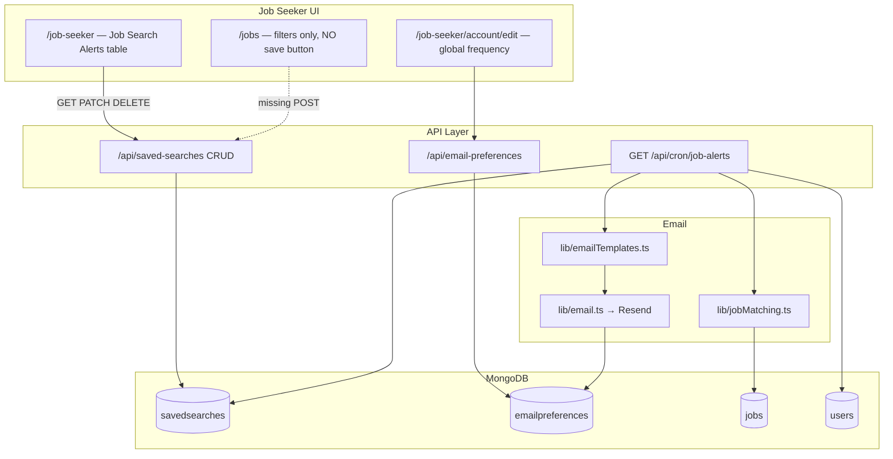

# Job Alert Functionality — Complete Audit

**Date:** 2026-06-04  
**Scope:** Chickenloop codebase (`chickenloop/`)  
**Terminology note:** The product UI uses “Job Search Alerts” / “job alerts.” The implementation is built on a **`SavedSearch`** model and **`/api/saved-searches`** APIs — there is no separate `JobAlert` collection or model.

---

## Executive Summary

| Area | Status |
|------|--------|
| Data model (`SavedSearch`) | **Implemented** |
| CRUD APIs (`/api/saved-searches`) | **Implemented** |
| Job matching engine (`lib/jobMatching.ts`) | **Partially implemented** (missing employment type & city; filter parity gaps) |
| Email delivery (Resend + templates) | **Implemented** |
| Scheduled sending (Vercel Cron) | **Implemented** |
| Global email preferences (`EmailPreferences`) | **Implemented** (overlaps with per-alert frequency) |
| Job Seeker dashboard management UI | **Partially implemented** (list/edit/delete only) |
| **Create alert from Jobs listing** | **Missing** (documented but not built) |
| Automated tests for alerts/matching/API | **Missing** |
| MailerLite / other ESP integrations | **Not present** |

The backend pipeline (save criteria → cron → match jobs → send email) is largely in place. The largest product gap is **no UI to create a saved search / job alert** from the jobs page, despite copy on the dashboard pointing users to a non-existent “Save Search” button.

---

## 1. Existing Job Alert Models / Schemas

### 1.1 Primary model: `SavedSearch`

| Item | Detail |
|------|--------|
| **File** | `models/SavedSearch.ts` |
| **Mongoose model name** | `SavedSearch` |
| **MongoDB collection** | `savedsearches` (default Mongoose pluralization) |
| **TypeScript interface** | `ISavedSearch` |

**Fields:**

| Field | Type | Purpose |
|-------|------|---------|
| `userId` | `ObjectId` → `User` | Owner |
| `name` | `string?` | Display name for the alert |
| `keyword` | `string?` | Title / description / company text search |
| `location` | `string?` | City substring match (see filter parity) |
| `country` | `string?` | ISO country code match |
| `category` | `string?` | Job occupational area |
| `sport` | `string?` | Activity/sport (API exposes as `activity`) |
| `language` | `string?` | Required job language |
| `frequency` | `'daily' \| 'weekly' \| 'never'` | Per-alert send cadence (default: `daily`) |
| `active` | `boolean` | Whether cron should process (default: `true`) |
| `lastSent` | `Date?` | Last job-list email timestamp |
| `lastHeartbeatSent` | `Date?` | Last “still watching” email when no matches |
| `createdAt` / `updatedAt` | `Date` | Timestamps |

**Indexes:**

- `{ userId: 1, active: 1 }`
- `{ active: 1, frequency: 1, lastSent: 1 }`

**Not stored (but exist on job search UI):**

- `city` (jobs UI uses separate `city` filter; saved search uses `location` only)
- `employmentType` (jobs UI filter exists; not in schema or matching)

### 1.2 Related model: `EmailPreferences`

| Item | Detail |
|------|--------|
| **File** | `models/EmailPreferences.ts` |
| **Collection** | `emailpreferences` |
| **Interface** | `IEmailPreferences` |

**Relevant fields:**

- `jobAlerts`: `'daily' | 'weekly' | 'never'` — **global** user preference (default `weekly`)
- `applicationUpdates`, `marketing` — unrelated to job alerts but share unsubscribe/preferences UI

**Registration default** (`app/api/auth/register/route.ts`): new users get `jobAlerts: 'weekly'` when preferences are created.

### 1.3 No dedicated `JobAlert` model

There is no `JobAlert`, `JobAlertSubscription`, or similar collection. All alert semantics live on `SavedSearch` plus global `EmailPreferences.jobAlerts`.

### 1.4 Other references

- `lib/db.ts` — registers `SavedSearch` model on connect
- `scripts/deleteUser.ts` — deletes user’s saved searches on account removal (admin script)

---

## 2. Existing Job Alert APIs

Base path: **`/api/saved-searches`**  
Auth: **`requireAuthAsync`** (job seeker session required)  
Client wrapper: **`savedSearchesApi`** in `lib/api.ts`

### 2.1 List alerts — `GET /api/saved-searches`

| | |
|---|---|
| **File** | `app/api/saved-searches/route.ts` |
| **Status** | ✅ Fully implemented |
| **Behavior** | Returns all saved searches for current user, newest first |
| **Response mapping** | Maps `sport` → `activity` in JSON for API consistency |

### 2.2 Create alert — `POST /api/saved-searches`

| | |
|---|---|
| **File** | `app/api/saved-searches/route.ts` |
| **Status** | ✅ API implemented · ❌ **No frontend caller** |
| **Body** | `name`, `keyword`, `location`, `country`, `category`, `activity`/`sport`, `language`, `frequency` |
| **Validation** | At least one filter required; `frequency` enum validated |
| **Defaults** | `frequency: 'weekly'`, `active: true` |
| **Gap** | Accepts `activity` but stores as `sport`; does not accept `city` or `employmentType` |

### 2.3 Update alert — `PATCH /api/saved-searches/[id]`

| | |
|---|---|
| **File** | `app/api/saved-searches/[id]/route.ts` |
| **Status** | ✅ Fully implemented |
| **Behavior** | Partial update; maps `activity` → `sport`; ownership check |
| **Dashboard usage** | Name, frequency, active toggle |

### 2.4 Delete alert — `DELETE /api/saved-searches/[id]`

| | |
|---|---|
| **File** | `app/api/saved-searches/[id]/route.ts` |
| **Status** | ✅ Fully implemented |
| **Dashboard usage** | Delete with confirm dialog |

### 2.5 Related APIs (not CRUD, but part of alert system)

| Endpoint | Purpose |
|----------|---------|
| `GET /api/cron/job-alerts` | Cron entry point; processes all active saved searches |
| `GET/PUT /api/email-preferences` | Global job alert frequency / opt-out |
| `GET /api/email/unsubscribe?token=...` | One-click unsubscribe (can disable job alerts category) |

### 2.6 API client (`lib/api.ts`)

```typescript
savedSearchesApi.getAll()
savedSearchesApi.create(data)   // defined but unused in app code
savedSearchesApi.update(id, data)
savedSearchesApi.delete(id)
```

---

## 3. Existing Email Functionality

### 3.1 Email provider

| Provider | Usage |
|----------|--------|
| **Resend** | ✅ Primary (`lib/email.ts`, `RESEND_API_KEY`, `RESEND_FROM_EMAIL`) |
| **Nodemailer** | Listed in `package.json`; used by NextAuth / not job alerts |
| **MailerLite** | ❌ **Not integrated** (no references in codebase) |

### 3.2 Scheduled jobs / cron

| Item | Detail |
|------|--------|
| **Config** | `vercel.json` → `"path": "/api/cron/job-alerts"`, `"schedule": "0 9 * * *"` (daily 09:00 UTC) |
| **Handler** | `app/api/cron/job-alerts/route.ts` |
| **Auth** | `Authorization: Bearer ${CRON_SECRET}` |
| **Background workers** | None (no Bull, Inngest, separate worker process, etc.) |

**Cron logic (summary):**

1. Load all `SavedSearch` where `active: true`
2. Skip `frequency: 'never'`
3. **Daily:** process if `lastSent` older than 24h (or never sent)
4. **Weekly:** process if `lastSent` older than 7 days (or never sent)
5. **Per-user cap:** max **1 job alert email per user per 24 hours** across all searches (in-run map + skip)
6. `findMatchingJobs(search, sinceDate)` — only jobs created since last send window
7. **Zero matches:** skip list email; optionally send **heartbeat** monthly (`lastHeartbeatSent`)
8. **Matches found:** `getJobAlertEmail()` → `sendEmail()` → update `lastSent`

### 3.3 Email templates

| Template | File | Function |
|----------|------|----------|
| Job alert (with matches) | `lib/emailTemplates.ts` | `getJobAlertEmail()` |
| Job alert heartbeat (no matches) | `lib/emailTemplates.ts` | `getJobAlertHeartbeatEmail()` |

Templates include HTML + plain text, job cards with links via `generateJobUrlPath`, featured styling, dashboard tip.

### 3.4 Email pipeline / gates

| Layer | File | Role |
|-------|------|------|
| Send | `lib/email.ts` | `sendEmail()`, `sendEmailAsync()` |
| Preferences | `lib/email.ts` | `canSendEmail()` — blocks if `EmailPreferences.jobAlerts === 'never'` |
| Rate limits | `lib/emailRateLimit.ts` | Soft limits: 1 job alert/hour, 3/day per user (logged, used in tests) |
| Unsubscribe | `lib/unsubscribeToken.ts`, `app/api/email/unsubscribe/route.ts` | Signed token links in email footer |
| Footer | `lib/email.ts` | `generateUnsubscribeFooter()` appended to non-critical emails |

**Preference interaction gap:**  
- **Per-alert** frequency lives on `SavedSearch.frequency` (cron respects this).  
- **Global** frequency lives on `EmailPreferences.jobAlerts` (`daily` / `weekly` / `never`).  
- Cron does **not** align global `daily` vs `weekly` with per-alert settings — only checks global `never`.  
- User can set account preference to “daily” while individual alerts are “weekly” (and vice versa).

### 3.5 Documentation (existing)

- `JOB_ALERTS_SETUP.md` — setup guide (partially aspirational on frontend)
- `docs/EMAIL_NOTIFICATIONS_AUDIT.md` — broader email audit (some unsubscribe notes may be outdated; functional unsubscribe exists for job alerts category)
- `VERCEL_ENV_SETUP.md` — mentions `CRON_SECRET`

---

## 4. Job Seeker Dashboard — “Job Search Alerts”

### 4.1 Location

| Item | Path |
|------|------|
| Page | `app/job-seeker/page.tsx` |
| Section title | **“Job Search Alerts”** (not “My Job Alerts”) |
| Position | Below “My Applications”, above “My Favourite Jobs” |

### 4.2 Components

**No dedicated component files.** All UI is inline in `JobSeekerDashboardClient` inside `app/job-seeker/page.tsx`:

- Table: name, criteria chips, frequency, active status, edit/delete
- Inline edit: name input, frequency select, active checkbox
- Empty state: message + link to `/jobs`

### 4.3 Data source & APIs

| Action | API |
|--------|-----|
| Load | `savedSearchesApi.getAll()` → `GET /api/saved-searches` |
| Toggle active | `savedSearchesApi.update(id, { active })` |
| Edit save | `savedSearchesApi.update(id, { name, frequency, active })` |
| Delete | `savedSearchesApi.delete(id)` |
| **Create** | ❌ Not implemented in dashboard or jobs page |

### 4.4 Dashboard features

| Feature | Status |
|---------|--------|
| List alerts | ✅ |
| View filter criteria as chips | ✅ |
| Link alert name → `/jobs?{filters}` | ✅ (uses `keyword`, `location`, `country`, `category`, `activity`, `language`) |
| Edit name / frequency / active | ✅ |
| Delete | ✅ |
| Create new alert | ❌ |
| Edit filter criteria after creation | ❌ (only name/frequency/active) |

### 4.5 Account-level preferences

`app/job-seeker/account/edit/page.tsx` — radio group for **Job Alerts**: Daily / Weekly / Never via `GET/PUT /api/email-preferences`.

Unsubscribe return flow: `?unsubscribed=true&category=user_notification` shows banner on job seeker (and recruiter) dashboards.

---

## 5. Job Search Filters — Parity Analysis

### 5.1 Jobs listing UI (`/jobs`)

| Filter | UI component | Query param | Server (`lib/jobs.ts`) |
|--------|--------------|-------------|-------------------------|
| **Keyword** | `JobSearchBar` | `keyword` | Title, description, company regex |
| **Location** | `JobSearchBar` | `location` | City OR country regex (+ country code lookup) |
| **Country** | `JobFiltersSidebar` | `country` | Country code (select uses **country name** as value) |
| **City** | `JobFiltersSidebar` | `city` | Exact city regex |
| **Category** | `JobFiltersSidebar` | `category` | `occupationalAreas` |
| **Employment type** | `JobFiltersSidebar` | `employmentType` | `type` field |
| **Activity** | `JobFiltersSidebar` | `activity` | `sports` array |
| **Language** | `JobFiltersSidebar` | `language` | `languages` array |

### 5.2 Saved search / job alert support

| Filter | SavedSearch field | Matching (`jobMatching.ts`) | Dashboard display |
|--------|-------------------|----------------------------|-------------------|
| Keyword | `keyword` | ✅ | ✅ |
| Location (search bar) | `location` | ✅ (city substring only) | ✅ |
| Country | `country` | ✅ (ISO code, case-insensitive) | ✅ |
| **City** | ❌ | ❌ (partial via `location`) | ❌ |
| Category | `category` | ✅ (`occupationalAreas` + validation) | ✅ |
| **Employment type** | ❌ | ❌ | ❌ |
| Activity | `sport` / API `activity` | ✅ (`job.sports`) | ✅ |
| Language | `language` | ✅ | ✅ |

### 5.3 Parity gaps (important)

1. **`city` vs `location`:** Jobs page can filter by exact city; alerts only store `location` (free-text city substring). Dashboard rebuilds job URLs with `location`, not `city`, so saved alerts cannot round-trip city-only searches from the UI.
2. **`employmentType`:** Fully supported on jobs listing; completely absent from alerts.
3. **Country representation:** Sidebar stores country **name** in URL; saved search API examples use **codes** (`ES`). Matching expects codes; mixed usage may cause inconsistent results if names are stored.
4. **Location search bar vs city filter:** Search bar `location` matches city OR country; saved search `location` only checks `job.city` in matching — not equivalent to live search.

---

## 6. Implementation Matrix

### 6.1 Fully implemented

- `SavedSearch` Mongoose model with indexes
- Authenticated CRUD API (GET/POST/PATCH/DELETE)
- Job matching for keyword, location, country, category, activity, language
- Cron job route + Vercel schedule
- Resend email sending with job alert + heartbeat templates
- Global opt-out via `EmailPreferences` and unsubscribe links
- Job seeker dashboard: list, edit metadata, toggle active, delete
- Account settings: global job alert frequency
- Client API wrapper (`savedSearchesApi`)
- Rate limiting hooks and unit tests for email preference / rate limit behavior
- User deletion script cleans up saved searches

### 6.2 Partially implemented

| Item | What exists | What’s missing / wrong |
|------|-------------|----------------------|
| **Create flow** | POST API | No “Save Search” on `/jobs`; `savedSearchesApi.create` never called |
| **Filter parity** | 6 of 8 filter types | No `city`, no `employmentType` in model/API/matching |
| **Frequency model** | Per-alert + global prefs | Two systems not unified; cron ignores global daily/weekly distinction |
| **Multi-alert users** | Multiple saved searches allowed | Cron sends **max 1 alert email per user per day** — additional searches suppressed |
| **Matching performance** | Works functionally | Loads all published jobs into memory per search (no MongoDB query filters) |
| **Documentation** | `JOB_ALERTS_SETUP.md` | Frontend steps described but not built |
| **Tests** | Email preference tests | No tests for `jobMatching`, saved-search routes, or cron |

### 6.3 Missing

- UI to create job alert from jobs page (modal / “Save this search”)
- UI to create alert from job seeker dashboard
- Ability to edit alert **criteria** after creation
- `employmentType` and `city` on saved searches
- Admin visibility (list alerts, debug sends, metrics)
- Dedicated `JobAlert` naming in UI/API (optional product consistency)
- Integration tests / E2E for alert lifecycle
- MailerLite or marketing automation for alerts
- Queue/retry for failed sends
- Persistent rate-limit store (in-memory only in `emailRateLimit.ts`)

### 6.4 Unused / dead code

| Item | Notes |
|------|--------|
| `savedSearchesApi.create()` | Exported, **zero usages** in `app/` or `components/` |
| Dashboard empty-state copy | References **“Save Search” button on the jobs page** — button does not exist |
| `JOB_ALERTS_SETUP.md` § Frontend Integration | Describes UI patterns not implemented |
| `sport` field name | Legacy; API maps to `activity` — dual naming persists in DB |
| `docs/EMAIL_NOTIFICATIONS_AUDIT.md` | Claims missing unsubscribe for alerts; functional unsubscribe now exists |

---

## 7. Existing Architecture



**Send decision chain:**

1. Cron selects active saved search (respects `SavedSearch.frequency`, `lastSent`)
2. User-level 24h cap (cron-internal)
3. `findMatchingJobs()` with `sinceDate`
4. `sendEmail()` → `canSendEmail()` (global `jobAlerts === 'never'` blocks)
5. Rate limit checks (soft)
6. Resend API

---

## 8. Missing Components (Prioritized)

### P0 — Blocks core product loop

1. **“Save search / Create job alert” on `/jobs`**  
   - Button + modal (name, frequency)  
   - Map current `JobListFilters` → POST body  
   - Call `savedSearchesApi.create()`  
   - Require job-seeker auth; prompt login/register if needed  

2. **Filter schema alignment**  
   - Add `city` and `employmentType` to `SavedSearch`  
   - Extend POST/PATCH, matching, dashboard chips, and job URL rebuild  

### P1 — UX & correctness

3. **Unify frequency model**  
   - Either drive cadence only from `EmailPreferences.jobAlerts`, or only from per-alert `frequency`, with clear UI copy  
   - If both kept: cron should respect global daily/weekly when deciding to process  

4. **Edit alert criteria** on dashboard (or “duplicate & edit” flow)  

5. **Multi-alert email strategy**  
   - Document or change 1-email-per-24h cap (batch matches from all due searches into one email?)  

6. **Country normalization**  
   - Store ISO codes consistently; convert from jobs UI country name on save  

### P2 — Quality & ops

7. **Tests:** `jobMatching.ts`, saved-search API routes, cron integration (mocked)  
8. **Matching optimization:** push filters into MongoDB query instead of full table scan  
9. **Observability:** admin view of last send, match counts, cron summary logs  
10. **Update `JOB_ALERTS_SETUP.md` and retire stale audit notes**

---

## 9. Recommended Implementation Plan

### Phase 1 — Complete the user-facing loop (1–2 sprints)

1. Add **Save Job Alert** to `app/jobs/JobList.tsx` or `JobFiltersSidebar`  
   - Visible when filters are active and user is job seeker  
   - Modal: alert name (auto-suggest from filters), frequency (daily/weekly)  
   - POST `/api/saved-searches` with mapped filters  
2. Fix empty-state copy on job seeker dashboard once create exists  
3. Add **`city`** and **`employmentType`** to model + API + `findMatchingJobs` + dashboard chips  
4. When rebuilding `/jobs?` links from alerts, include `city` and `employmentType` query params  

### Phase 2 — Preference & delivery consistency

5. Define single source of truth for frequency (recommend: **per-alert `frequency`**, global `jobAlerts` only as master off switch)  
6. Update account settings copy to clarify relationship  
7. Review cron user cap: combine multiple due searches into one digest email per user per day  
8. Align `location` matching with jobs search bar behavior (city + country) or deprecate `location` in favor of `city` + `country`  

### Phase 3 — Hardening

9. Add unit tests for `findMatchingJobs` (all filter types, sinceDate, featured sort)  
10. Add API route tests (auth, validation, ownership)  
11. Add monitoring alert on cron `errors` count / zero sends anomaly  
12. Optional: rename product strings to “Job Alert” while keeping `SavedSearch` collection for backward compatibility  

---

## 10. Key File Reference

| Concern | Path |
|---------|------|
| Model | `models/SavedSearch.ts` |
| Email prefs model | `models/EmailPreferences.ts` |
| List/create API | `app/api/saved-searches/route.ts` |
| Update/delete API | `app/api/saved-searches/[id]/route.ts` |
| Cron | `app/api/cron/job-alerts/route.ts` |
| Matching | `lib/jobMatching.ts` |
| Job list filters | `lib/jobs.ts`, `app/jobs/JobList.tsx`, `app/jobs/JobFiltersSidebar.tsx` |
| Email send | `lib/email.ts` |
| Templates | `lib/emailTemplates.ts` (`getJobAlertEmail`, `getJobAlertHeartbeatEmail`) |
| Client API | `lib/api.ts` (`savedSearchesApi`) |
| Dashboard UI | `app/job-seeker/page.tsx` |
| Account prefs UI | `app/job-seeker/account/edit/page.tsx` |
| Cron config | `vercel.json` |
| Setup doc | `JOB_ALERTS_SETUP.md` |

---

## 11. Conclusion

Chickenloop’s job alert feature is **backend-heavy and frontend-incomplete**. The **`SavedSearch`** model and **`/api/saved-searches`** endpoints provide a solid foundation, and the **daily Vercel cron + Resend email pipeline** can deliver alerts when data exists. However, **users cannot create alerts from the product UI today**, which makes the feature effectively dormant for most job seekers despite dashboard management UI and marketing copy referencing it.

Closing the create flow on `/jobs`, aligning filters with the jobs listing (especially **city** and **employment type**), and resolving the **dual frequency** and **one-email-per-day** policies should be the top priorities before investing in new providers (e.g. MailerLite) or advanced automation.
